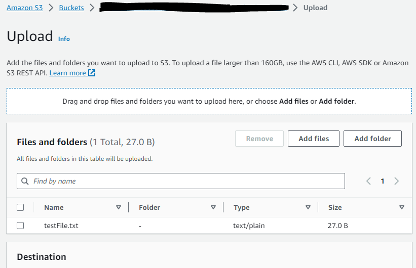
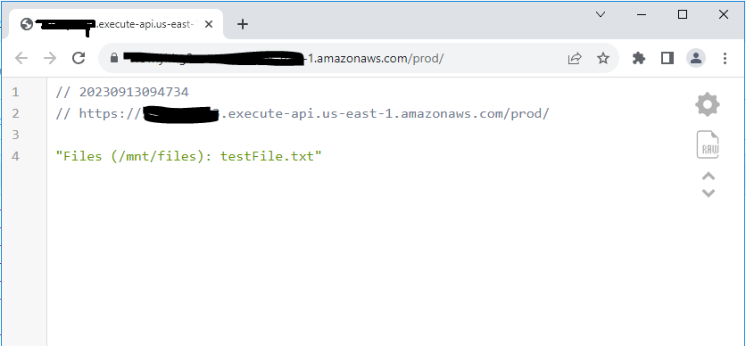

# An Example of moving file objects from S3 to EFS Using Lambda

This example demonstrates how a file can be moved from S3 bucket to an EFS file system using a lambda function.  This can be very useful if you have bacground processes that gets files from external systems and your applications uses a file system to read those files without using additional AWS SDK code.  Applications will have to mout the EFS volume to read the files.  This project is deployed using AWS CDK.

## What does it build?
* Creates a S3 Bucket for source files
* Creates an EFS
* Creates a Lambda function to move files between S3 and EFS
* Creates S3 event when a new file is created and automatically invoke the file move lambda
* Creates a separate Lambda that reads file list from the EFS volume and Exposes using API Gateway

## Steps to run and test
* Deploy the CDK Code. Wait for the deploy to finish.
* Upload a file to created S3 bucket from your local machine 
  * 
* Click on the API Gateway endpint to view the file name from EFS.
  * 

## Next Steps
* Add Virus Scanning before the file is copied to EFS.  Refer to the ClamAV Rest API (https://github.com/smislam/clamav-rest-api) project in Github.
* After a file is moved, do we need to remove it from S3 or sent to archival?
* If a file is deleted from S3, what do we do?